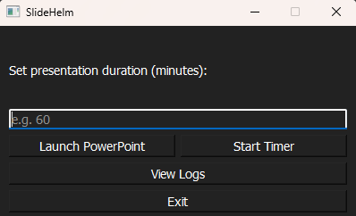
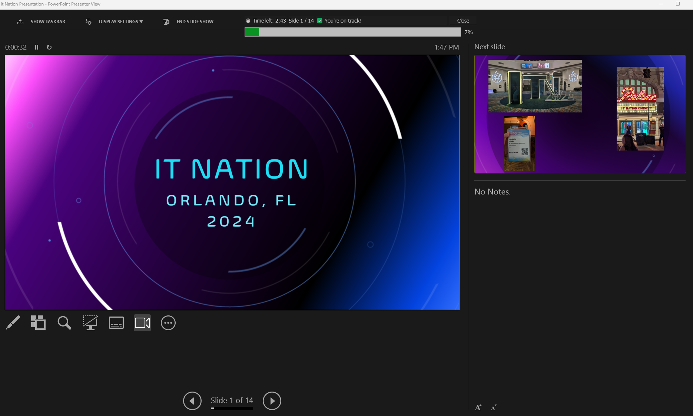
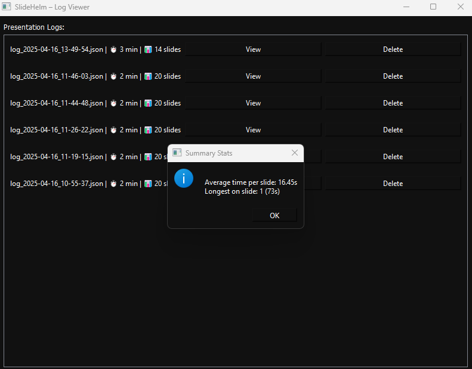
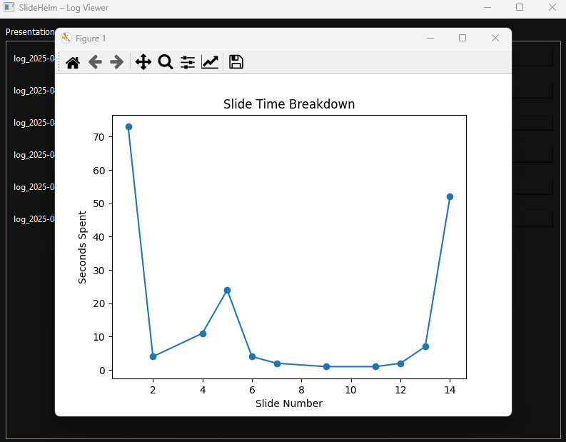

# 🧭 SlideHelm

**Real-time presentation pacing overlay for PowerPoint.**

SlideHelm helps presenters stay on track by visually showing whether they’re ahead, behind, or right on schedule — without disrupting the flow of a presentation.

---

## 🧠 Use Case

SlideHelm was built for speakers who deliver **slide-heavy presentations with a fixed time limit** — like corporate events, lectures, training sessions, or dinner talks.

It’s designed to be **friendly, supportive, and easy to use**, without being distracting or stressful.

---

## 🛠️ Features

- 🎯 Tracks your **current slide** and compares it to where you *should* be
- ✅ Gives real-time pacing feedback:
  - "You're on track!"
  - "You're ahead — consider slowing down"
  - "You're well behind — consider skipping less critical slides"
- ⏱️ Customizable presentation duration
- 🪟 Minimal, draggable **floating overlay** with slide + time tracking
- 📈 Logs all sessions for historical review and analytics
- 📊 Built-in graph viewer and summary statistics

---

## 📸 Screenshots

### 🛠️ Setup Interface



*Configure your presentation duration, launch PowerPoint, and start the pacing overlay.*

---

### ⏱️ Live Timer Overlay



*A floating, draggable overlay shows time remaining, current slide number, pacing feedback, and a slide progress bar.*

---

### 📂 Log Viewer



*Review past presentations, view details about each session, and access analytics.*

---

### 📊 Statistics Dashboard



*Visualize how long you spent on each slide and see pacing summaries like average time per slide and most time spent.*

--

## 📦 Installation

You can either:
1. **Run from source** (Python)
2. **Install via EXE** (no Python needed)

### 🔹 Option A: Use the Installer

Download the latest `SlideHelmInstaller.exe` from the [Releases](https://github.com/jcline123/SlideHelm/releases/tag/v1.0.0) page and run it.

- Adds a desktop shortcut  
- No setup or dependencies required  
- Uninstall anytime from Control Panel

### 🔹 Option B: Run from Python (dev mode)

> Requires: Python 3.10+ and pip

```bash
pip install -r requirements.txt
python presentation_overlay.py
```

---

## 🧪 How It Works

SlideHelm uses the PowerPoint COM interface to detect:
- When a presentation is open
- When slideshow mode begins
- Which slide you're currently on

It then compares your progress to the expected pace based on your entered time limit.

The overlay floats above your presentation (can be moved anywhere), showing:
- ⏱️ Time remaining
- 📄 Current slide
- 🟢 Pacing feedback
- 📊 Slide progress bar

---

## 📂 Logging & Analytics

Each session is logged to:

```
%LOCALAPPDATA%\SlideHelm\logs\
```

For every presentation, SlideHelm records:
- Time elapsed
- Slide position
- Pacing status per second

You can view past logs in the **Log Viewer**:
- See how long you spent on each slide
- Get pacing summary statistics
- View line charts to analyze timing patterns
- Delete test runs to keep stats accurate

---

## 📌 Known Limitations

- Currently supports only **Windows** (due to PowerPoint COM API)
- Requires PowerPoint to be installed and open before starting
- Overlay doesn't auto-start slideshow — user still presses `F5`

---

## 🪪 License

MIT License — free to use, modify, and share.

---

## 🙌 Acknowledgments

SlideHelm was created as a personal project to support live presentations with clarity and calm — and it’s grown into something flexible and powerful for anyone giving structured talks.
